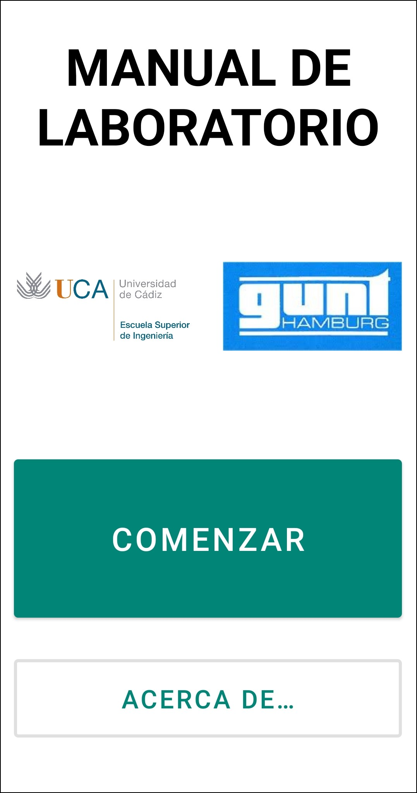
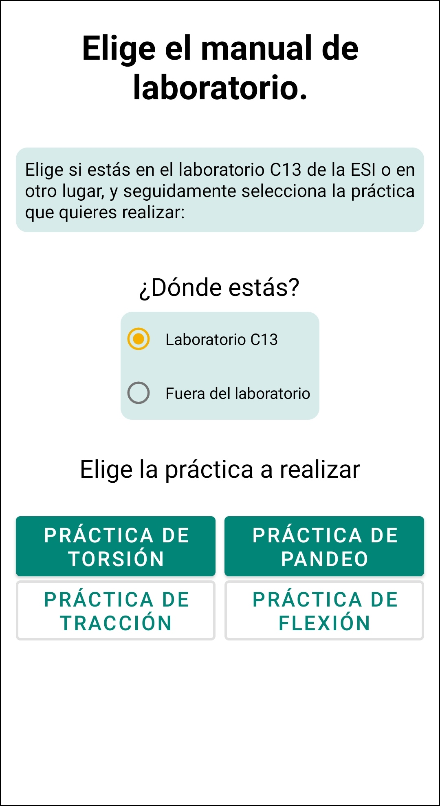

# Manual de Laboratorio
Aplicación de Realidad Aumentada para los estudiantes de la asignatura de Resistencia de Materiales de la Escuela Superior de Ingeniería de la Universidad de Cádiz.

  
  

## Objetivo

Esta aplicación ha sido desarrollada como parte de un Trabajo de Fin del Grado de Ingeniería Informática en la Universidad de Cádiz. Tiene como objetivo mejorar la calidad de las prácticas de laboratorio de la asignatura de Resistencia de Materiales. 

Ha sido desarrollada íntegramente por Santiago Jesús Mas Peña, bajo la dirección de Milagros Huerta y Manuel Palomo.

Este proyecto ha sido financiado en la convocatoria de Innovación Docente de la Universidad de Cádiz 2018-20 "Proyecto de Innovación Docente de la UCA".

## Características

- Permite realizar los siguientes manuales de laboratorio:
  - Experimento de carga de Torsión 
  - Experimento de desviación en Pandeo
- Contiene un [Módulo de Realidad Aumentada](https://www.github.com/GRsni/AR_module) que muestra cómo realizar los experimentos tanto dentro como fuera del laboratorio de Resistencia de Materiales
- Contiene una pequeña encuesta voluntaria de satisfacción que los usuarios pueden responder para poder mejorar la aplicación.
- Aplicación desarrollada íntegramente en Kotlin y XML: Emplea Jetpack Navigation, DataBinding, MVVM y componentes de Material Design.
- Los datos de prácticas de los alumnos se almacenan en una base de datos externa, y pueden ser recopilados a través de la aplicación de [Gestor de Alumnos](https://www.github.com/GRsni/Student_Manager_App)
